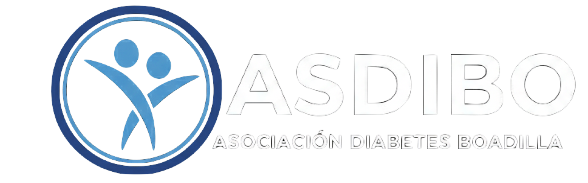

# ASDIBO - Asociación de Diabetes de Boadilla del Monte



[](https://asdibo.web.app)
[](https://firebase.google.com/)
[](#)

> **"Acompañar, informar y unir a familias y personas con diabetes."**

Este repositorio contiene el código fuente del sitio web oficial de **ASDIBO**, la Asociación de Diabetes de Boadilla del Monte. La plataforma sirve como punto de encuentro digital para socios, familias y personas interesadas en mejorar su calidad de vida conviviendo con la diabetes.

---

## 📋 Sobre el Proyecto

El sitio web de ASDIBO es una plataforma informativa y de gestión comunitaria diseñada para ofrecer recursos, noticias y calendarios de actividades a los vecinos de Boadilla del Monte y alrededores.

### Objetivos Principales
* **Apoyo Familiar:** Acompañamiento a familias con diagnósticos recientes (Tipo 1 y Tipo 2).
* **Formación:** Difusión de talleres, charlas sobre tecnología (bombas, sensores) y alimentación.
* **Comunidad:** Fomento de actividades saludables y encuentros sociales.
* **Visibilidad:** Punto de contacto oficial con instituciones (FEDE, Ayuntamiento de Boadilla).

---

## 🚀 Características del Sitio

El proyecto consta de varias secciones clave desarrolladas para la comunidad:

* 🏠 **Portal de Inicio:** Presentación de la asociación y últimas novedades.
* 📅 **Gestión de Eventos:** Calendario de talleres, caminatas y charlas (integrado con *FullCalendar*).
* 📰 **Blog de Noticias:** Artículos sobre avances médicos, experiencias y resúmenes de actividades.
* 🤝 **Hazte Socio:** Información y formularios para nuevas inscripciones.
* 🔍 **Transparencia:** Publicación de estatutos y documentación oficial.
* 📱 **Contacto Directo:** Integración con WhatsApp y redes sociales.

---

## 🛠️ Tecnologías Utilizadas

Este proyecto es un sitio web estático moderno, optimizado para velocidad y despliegue rápido.

| Categoría | Tecnologías |
| :--- | :--- |
| **Frontend Core** |    |
| **Framework CSS** |  (Diseño Responsive) |
| **Librerías JS** | `jQuery`, `Modernizr`, `Owl Carousel`, `FlexSlider`, `Magnific Popup` |
| **Infraestructura** |  |
| **CI/CD** |  (Despliegue automático) |

---

## 📂 Estructura del Proyecto

```text
asdibo/
├── .github/workflows/   # Flujos de trabajo para despliegue automático en Firebase
├── public/              # Directorio raíz del sitio web (archivos públicos)
│   ├── api/             # Scripts auxiliares (PHP) para integraciones
│   ├── css/             # Hojas de estilo (Bootstrap, Custom, Skins)
│   ├── docs/            # Documentos públicos (Estatutos PDF, etc.)
│   ├── images/          # Recursos gráficos, logos y fotos de eventos
│   ├── js/              # Lógica del frontend y plugins
│   ├── vendor/          # Librerías de terceros (FullCalendar, etc.)
│   ├── index.html       # Página principal
│   └── ...              # Otras páginas HTML (about, contact, blog, etc.)
├── .firebaserc          # Configuración del proyecto Firebase
├── firebase.json        # Reglas de hosting de Firebase
└── .gitignore           # Archivos ignorados por Git
